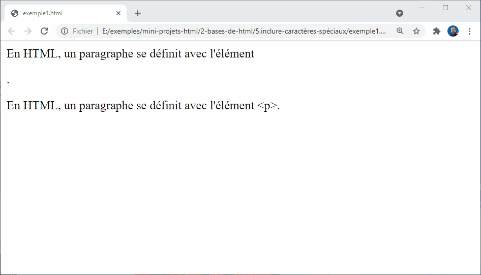

# Espace et caractères spéciaux

## Objectifs

## Espace vide en HTML

Dans les exemples que nous avons vu, vous avez peut-être remarqué que beaucoup d'espaces sont inclus dans le code — ce n'est pas nécessaire du tout. Les deux extraits de code suivants sont équivalents:

```html
<p>Les chiens sont idiots.</p>

<p>Les chiens        sont
           idiots.</p>
```

Peu importe la quantité d'espace que vous utilisez (pour inclure des espaces, ou aussi des sauts de ligne), l'analyseur HTML réduit chacun à un seul espace lors du rendu du code. Alors, pourquoi utiliser autant d'espace blanc? La réponse est la lisibilité — car il est tellement plus facile de comprendre ce qui se passe dans votre code si vous l'avez bien formaté, et non pas simplement l'écrire dans un grand désordre.

## Inclure les caractères spéciaux en HTML

En HTML, les caractères <, >,",' et & sont des caractères spéciaux. Ils font partie de la syntaxe HTML elle-même, alors comment inclure un de ces caractères dans du texte, par exemple si vous voulez vraiment utiliser une esperluette(&) ou un signe inférieur(<), qui ne soit pas interpré en tant que code comme les navigateurs pourraient le faire ?

Nous devons utiliser les références des caractères — codes spéciaux qui représentent des caractères et peuvent être utilisés dans ces circonstances exactes. Chaque référence de caractère est démarrée avec une esperluette (&), et se termine par un point-virgule (;).

|Le caractère   |Réference équivalent   |
|---            |---                    |
|<              |``&lt;``               |
|>              |``&gt;``               |
|"              |``&quot;``             |
|'              |``&apos;``             |
|&              |``&amp;``              |

Dans l'exemple ci-dessous, voici deux paragraphes parlant de techniques Web :

```html
<p>En HTML, un paragraphe se définit avec l'élément <p>.</p>

<p>En HTML, un paragraphe se définit avec l'élément &lt;p&gt;.</p>
```

Dans la zone de rendu en direct ci-dessous, vous pouvez voir que le premier paragraphe n'est pas correctement affiché : le navigateur interprète le second <p> comme le début d'un nouveau paragraphe ! Le deuxième paragraphe est bien affiché, car nous avons remplacé les  signes inférieur(<)  et supérieur(>) par leurs références de caractère.



## Résumé