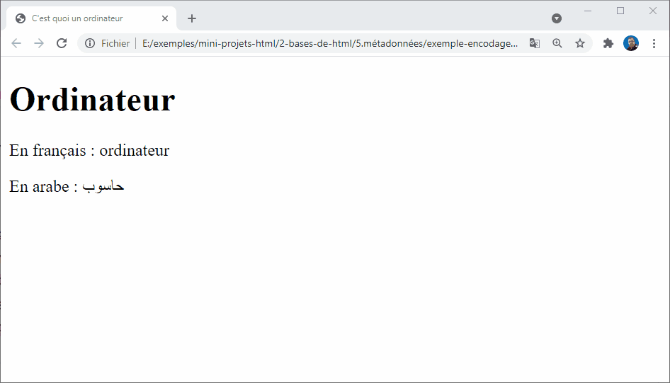
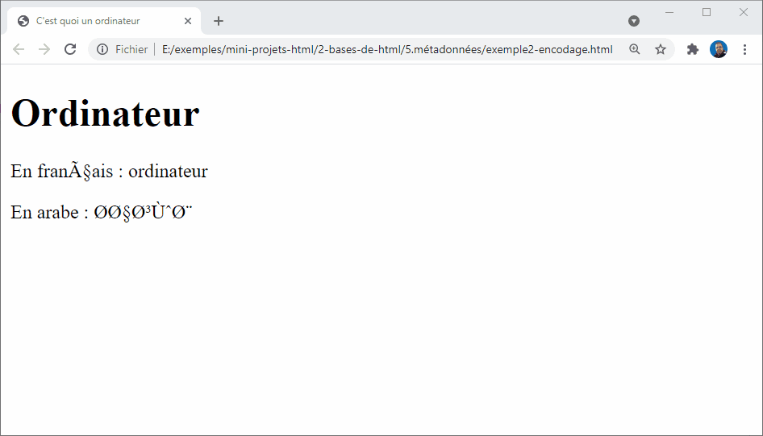

# Métadonnées en HTML

L'en-tête **head** dans un document HTML est une partie du document qui n'est pas affichée par le navigateur au chargement de la page. Elle contient des informations comme le titre (``<title>``) de la page, des liens aux CSS (si vous souhaitez composer le contenu HTML avec des CSS), des liens aux favicons personnalisés et d'autres méta-données (auteur du document, mots-clés décrivant le document, etc.). 

Cette session porte sur tout ceci et plus, pour vous donner de bonnes bases pour gérer les balises et le code qui devraient figurer dans l'en-tête de la page.

## Objectifs

Les objectifs sont les suivant : 

- En savoir plus sur la balise <head> du HTML, 
- son objet, 
- les éléments les plus importants qu'elle peut contenir 
- et l'effet qu'elle peut avoir sur le document HTML.

## Qu'est-ce que l'en-tête de HTML ?

Revoyons le document HTML de notre exemple : 

````html
<!DOCTYPE html>
<html>
  <head>
    <meta charset="utf-8">
    <title>Ma page test</title>
  </head>
  <body>
    <p>Voici ma page</p>
  </body>
</html>
````

Le contenu de l'en-tête HTML ``<head>`` — à la difference du contenu de l'élément ``<body>`` (affiché quand la page est chargée par le navigateur) — n'est pas affiché dans la page du navigateur. Le travail de la balise ``<head>`` est de contenir les métadonnées à propos du document. Dans notre exemple l'en-tête est plutôt petit :

````html
<head>
    <meta charset="utf-8">
    <title>Ma page test</title>
</head>
````

Toutefois dans les pages plus importantes, l'en-tête peut contenir un grand nombre d'éléments — essayez d'aller sur certains de vos sites web préférés et utilisez les outils de développement pour vérifier le contenu de l'en-tête. Mon objectif ici n'est pas de vous montrer comment utiliser tout ce qui peut être mis dans l'élément ``<head>``, mais plutôt de vous apprendre à utiliser les outils les plus évidents, que vous souhaiterez inclure dans l'en-tête, et vous les rendre plus familiers. Commençons.

## Ajouter un titre

Nous avons déjà vu l'élément ``<title>`` — qui peut être utilisé pour ajouter un intitulé au document. Il peut toutefois être confondu avec l'élément ``<h1>``, pour ajouter un en‑tête de haut niveau au contenu de votre page dans l'élément ``<body>`` — quelquefois désigné comme étant le « titre de la page ». Mais ce sont des choses différentes !

````html
<!DOCTYPE html>
<html>
  <head>
    <meta charset="utf-8">
    <title>Ma page de test</title>
  </head>
  <body>
    <h1>Element h1</h1>
  </body>
</html>
````

- L'élément ``<h1>`` apparaît dans la page quand elle est chargée dans le navigateur — généralement, il devrait être utilisé une fois par page, pour marquer le titre du contenu de votre page (le titre d'une histoire, ou d'une actualité, ou tout ce qui vous paraît approprié).
- L'élément ``<title>`` est une métadonnée qui représente l'intitulé du document HTML global (non le contenu du document).

## Pratique - Ajouter un titre

<!-- g layout : t 12-8 p-30 -->


````html
<!DOCTYPE html>
<html>
  <head>
    <meta charset="utf-8">
    <title>Ma page de test</title>
  </head>
  <body>
    <h1>Element h1</h1>
  </body>
</html>
````

Le contenu de l'élément ``<title>`` est aussi utilisé de manières différentes . Par exemple, si vous tentez de marquer cette page dans vos Marques-pages ( Marques-pages > Marquer cette page ou bien l'étoile dans la barre d'outils de Firefox), vous verrez que le contenu de ``<title>`` est suggéré comme nom pour le marque-page.

Le contenu de ``<title>`` est aussi utilisé dans les résultats de recherches, comme vous le verrez ci‑dessous

## Métadonnées : l'élément meta

Les métadonnées sont des données qui décrivent des données, et le langage HTML a une manière « officielle » d'ajouter des métadonnées à un document — l'élément ``<meta>``. Bien sûr, d'autres choses, dont nous parlons dans cette session, pourraient aussi être considérées comme des métadonnées. Il y a une panoplie d'autres éléments de type ``<meta>`` qui auraient pu figurer dans l'en-tête de votre page, mais nous n'en parlerons pas pour l'instant, car ce serait trop déroutant. À la place, nous expliquerons quelques éléments que vous pourriez voir, juste pour vous donner une idée.

## Définition de l'encodage des caractères du document

Dans l'exemple que nous avons vu, cette ligne était présente :

````html
<meta charset="utf-8">
````

Cet élément définit l'encodage des caractères du document - le jeu de caractères qu'il est autorisé à utiliser. **utf-8** est un jeu de caractères universel qui inclut à peu près tous les caractères des langues humaines. Cela signifie que votre page web sera capable de gérer l'affichage de n'importe quelle langue ; c'est donc une bonne idée de le définir dans chaque page web que vous créez ! Par exemple, votre page peut gérer le français et le l'arabe sans aucun souci :

````html
<!DOCTYPE html>
<html>
<head>
    <meta charset="utf-8">
    <title>C'est quoi un ordinateur</title>
</head>
<body>
    <h1>Ordinateur</h1>
    <p>En français : ordinateur</p>
    <p>En arabe : حاسوب</p>
</body>
</html>
````



> Note : Certains navigateurs (par ex. Chrome) corrigent automatiquement les encodages  incorrects, ainsi selon le navigateur utilisé, ce problème pourrait vous passer totalement inaperçu. Vous devriez quand même définir un encodage utf-8 sur votre page de toutes façons pour éviter tout problème potentiel avec d'autres navigateurs.

Si vous définissez votre encodage de caractères en **ISO-8859-1** , par exemple (le jeu de caractères de l'alphabet latin), le rendu de votre page sera totalement perturbé :



## Pratique - encodage des caractères

<!-- g layout : t 12-8 p-30 -->


## Ajouter  le nom de l'auteur et une description

De nombreux éléments ``<meta>`` contiennent les attributs **name** et **content** :

- **name** définit le type de méta élément ; le type d'informations  contenu.
- **content** définit le contenu réel de la métadonnée.
  
Il est utile d'inclure ces deux méta-éléments dans votre page pour définir son auteur et donner une courte description de son contenu. Voyons un exemple :

````html
<!DOCTYPE html>
<html>
<head>
    <meta charset="UTF-8">
    <title>Informatique</title>
    <meta name="author" content="ESSARRAJ Fouad">
    <meta name="description" content="Introduction à l'informatique.">
</head>
<body>
    
</body>
</html>
````

Préciser l'auteur peut être intéressant dans certains cas : il est utile de savoir qui a écrit la page pour le contacter et lui poser des questions à propos du contenu.

Définir une description qui incorpore des mots-clés relatifs au contenu de la page est utile ; votre page pourra ainsi apparaître plus haut dans la liste de recherches par pertinence créée par un moteur de recherche (ce processus se nomme Search Engine Optimization ou **SEO** — optimisation du moteur de recherche.)

## Pratique - encodage des caractères

<!-- g layout : t 12-8 p-30 -->


- voir l'impact du l'insertion d'un élément meta de type description, dans les résultats de recherche sur google.com
   
## Ajouter des icônes personnalisées à un site

Pour enrichir davantage le design de votre site, vous pouvez ajouter des références à des icônes personnalisées dans vos métadonnées et celles-ci seront affichées dans certains contextes.

La petite favicône, qui existe depuis de nombreuses années, a été la première icône de ce type, une icône de 16 x 16 pixels utilisée dans de multiples endroits. Vous verrez des favicônes affichés dans chaque onglet du navigateur pour chaque page ouverte et à côté des pages marquées dans le panneau des signets.

Une favicône peut être ajoutée à votre page de la façon suivante :

- Enregistrez-la dans le même répertoire que la page d'index du site, sous le format .ico (la plupart des navigateurs prendront en charge les favicônes dans des formats plus communs comme .gif ou .png, mais utiliser le format ICO assurera son fonctionnement  depuis Internet Explorer 6.)
- Ajoutez la ligne suivante dans votre ``<head>`` du HTML pour la référencer 

````html
<link rel="shortcut icon" href="favicon.ico" type="image/x-icon">
````

Voici un exemple de favicône dans un panneau de favoris :

## Définition de la langue principale du document

Enfin, il convient de mentionner que vous pouvez (et devrez vraiment) définir la langue de votre page. Cela peut être fait en ajoutant l'attribut lang à la balise ouvrante HTML.

````html
<html lang="fr">
````

Ceci est utile de plusieurs façons. Votre document sera indexé plus efficacement par les moteurs de recherche si son langage est défini (ce qui lui permet d'apparaître correctement dans les résultats spécifiques à la langue, par exemple).

## Résumé

Cela marque la fin de notre tour rapide de l'en-tête HTML — il y a beaucoup plus de possibilités ici, mais un panorama exhaustif serait ennuyeux et susceptible de vous embrouiller à ce stade, nous voulions simplement vous donner une idée des éléments les plus courants. Dans la session suivant, nous allons étudier ...

