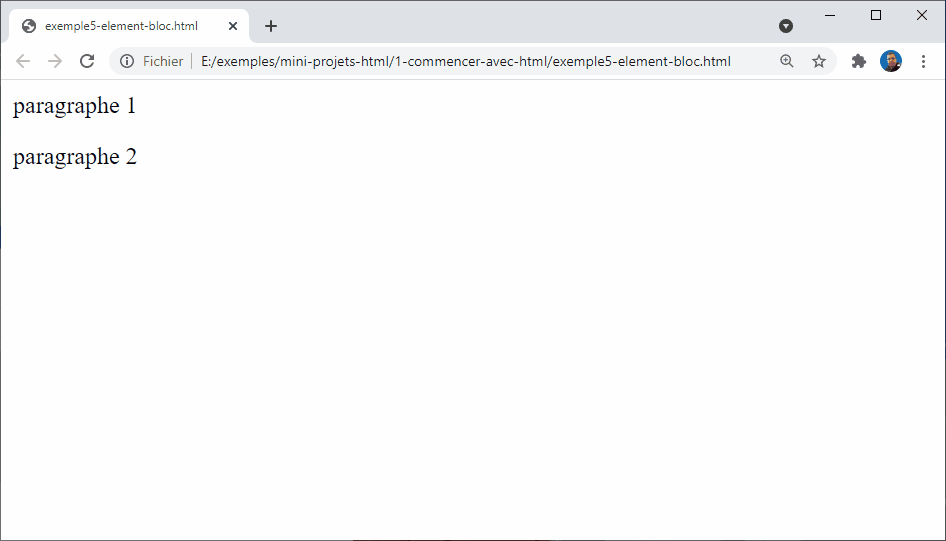

# Élément bloc et enligne

Les objectifs de cette session de formation sont les suivants :  

- Comprendre la différence entre un élément bloc et en line,
- Apprendre à utiliser ces deux type d'éléments.

## Éléments bloc vs en ligne

<!-- g layout : t 6 6 -->

<!-- note -->

Il existe deux catégories importantes d'éléments en HTML que vous devez connaître : les éléments de niveau bloc et les éléments en ligne.

<!-- end note -->




## Éléments bloc
 
<!-- layout : Code html image  -->


<!-- note -->

Les éléments de niveau bloc forment un bloc visible sur une page — ils apparaissent sur une nouvelle ligne quel que soit le contenu précédant et tout contenu qui les suit apparaît également sur une nouvelle ligne. 

<!-- end note -->


```html
<p>paragraphe 1</p><p>paragraphe 2</p>
```


<!-- new slide -->

<!-- layout : Code html image  -->

```html
<p>paragraphe 1</p><em>phrase1</em>
```


<!-- note -->

Les éléments de niveau de bloc sont souvent des éléments structurels de la page et représentent, par exemple, des paragraphes, des listes, des menus de navigation, des pieds de page, etc. 

<!-- end note -->


## Éléments en ligne

<!-- layout : Code html image  -->

<!-- note -->

Les éléments en ligne entourent seulement des petites parties du contenu du document et il n'entroune par un element bloc. Un élément en ligne ne fait pas apparaître une nouvelle ligne dans le document. 

Prenez l'exemple suivant :

<!-- end note -->

```html
<em>phrase 1</em><em>phrase 2</em>
```


   
<!-- note -->

`<em>` est un élément en ligne et, comme vous pouvez le voir ci-dessous, les éléments s'affichent sur la même ligne sans qu'il n'y ait d'espace entre eux. 

<!-- end note -->

## Conclusion

Voilà tous, pour cette session de formation. Je vous ai montrer la différence entre un élément de type bloc et en ligne.


