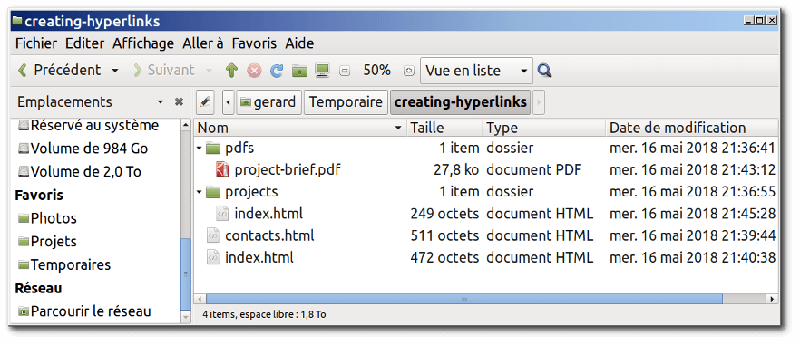

# Une brève présentation des URL et des chemins

Pour bien maîtriser les cibles des liens, vous avez besoin d'avoir compris ce que sont les URL et les chemins. Cette section vous donne les informations voulues pour y parvenir.

Une URL, ou Uniform Resource Locator, est simplement une chaîne textuelle qui définit où se situe quelque chose sur le Web. Par exemple, la page d'accueil en anglais de Mozilla est située à l'adresse https://www.mozilla.org/en-US/.

Les URL utilisent des chemins pour trouver des fichiers. Les chemins indiquent où dans le système de fichiers, se trouve celui qui vous intéresse. Regardons un exemple simple de structure de répertoires (voir le dossier creating-hyperlinks).



La racine de cette structure de répertoires s'appelle creating-hyperlinks. Quand vous travaillez localement sur un site web, vous avez un dossier contenant l'intégralité du site. Dans la racine, nous avons un fichier index.html et un contacts.html. Sur un site réel, index.html serait notre page d'accueil ou portail (page web servant de point d'entrée à un site web ou à une section particulière d'un site web).

Il y a aussi deux répertoires dans la racine — pdfs et projects. Chacun d'eux comporte un seul fichier — respectivement un PDF (project-brief.pdf) et un fichier index.html. Notez que vous pouvez heureusement avoir deux fichiers index.html dans un projet, pour autant qu'ils se trouvent dans deux emplacements différents dans le système de fichiers. De nombreux sites web le font. Le second index.html peut être le portail des informations relatives au projet.

Dans un même dossier : si vous voulez inclure un hyperlien dans index.html (celui de plus haut niveau) pointant vers contacts.html, il suffit d'indiquer uniquement le nom du fichier auquel vous voulez le lier, car il est dans le même répertoire que le fichier actuel. Ainsi, l'URL à utiliser est contacts.html :

````html
<p>Voulez‑vous rencontrer un membre du personnel en particulier ?
Voyez comment faire sur notre page <a href="contacts.html">Contacts</a>.</p>
````

Descendre dans les sous-répertoires : si vous désirez inclure un hyperlien dans index.html (celui de plus haut niveau) pointant vers projects/index.html, vous avez besoin de descendre dans le dossierprojects avant d'indiquer le fichier auquel vous voulez vous lier. Cela se fait en indiquant le nom du dossier, suivi d'une barre oblique normale, puis le nom du fichier. Donc l'URL à utiliser sera projects/index.html :

````html
<p>Visitez la <a href="projects/index.html">page d'accueil</a> de mon projet.</p>
````

Monter dans les dossiers parents : si vous voulez inclure un hyperlien dans projects/index.html qui pointe vers pdfs/projects-brief.pdf, vous aurez besoin de monter dans le répertoire au niveau au‑dessus, puis de descendre dans le dossier pdfs. « Monter dans le répertoire au niveau au‑dessus » est indiqué avec deux points — .. —, de sorte que l'URL à utiliser sera ../pdfs/project‑brief.pdf :

````html
<p>Voici un lien vers mon <a href="../pdfs/project-brief.pdf">sommaire de projet</a>.</p>
````

> Note : Vous pouvez combiner plusieurs instances de ces fonctionnalités dans des URL complexes si nécessaire, par ex. ../../../complexe/path/to/my/file.html.

## URL absolue vs. URL relative

Deux termes que vous rencontrerez sur le Web sont URL absolue et URL relative :

URL absolue : pointe sur un emplacement défini de manière absolue sur le web, y compris en précisant le protocole et le nom de domaine. Ainsi par exemple, si une page index.html est téléversée dans le dossier nommé projects à la racine du serveur web, et que le domaine du site est http://www.example.com, la page sera accessible à l'adresse http://www.example.com/projects/index.html (ou même seulement http://www.example.com/projects/, du fait que la plupart des serveurs web cherchent pour le chargement une page d'accueil comme index.htm, si ce n'est pas précisé dans l'URL).

Une URL absolue pointera toujours vers le même emplacement, quel que soit l'endroit où elle est utilisée.

URL relative : pointe vers un emplacement qui est relatif au fichier à partir duquel vous établissez le lien, tout comme ce que nous avons vu précédemment. Donc, si nous voulons créer un lien depuis notre fichier d'exemple en http://www.example.com/projects/index.html vers un fichier PDF dans le même dossier, l'URL sera seulement le nom du fichier — càd., project-brief.pdf — pas besoin d'information supplémentaire. Si le PDF est disponible dans un sous-dossier de projects appelé pdfs, le lien relatif serait pdfs/project-brief.pdf (l'URL absolue équivalente serait http://www.example.com/projects/pdfs/project-brief.pdf.)

Une URL relative pointera vers des emplacements différents en fonction de l'endroit où se situe le fichier qui est utilisé ; par exemple, si nous déplacions notre index.html du dossier projects vers la racine du site web (au niveau le plus élevé, dans aucun dossier), le lien de l'URL relative pdfs/project-brief.pdf qui s'y trouve pointerait alors vers un fichier situé en http://www.example.com/pdfs/project-brief.pdf, et non vers un fichier situé en http://www.example.com/projects/pdfs/project-brief.pdf.

Bien sûr, l'emplacement du fichier project-brief.pdf et du dossier pdfs ne changera pas subitement du fait que vous avez déplacé le fichier index.html : cela aura pour effet que votre lien pointera vers un mauvais emplacement, de sorte que cela ne fonctionnera pas si on clique dessus. Vous devez être prudent !