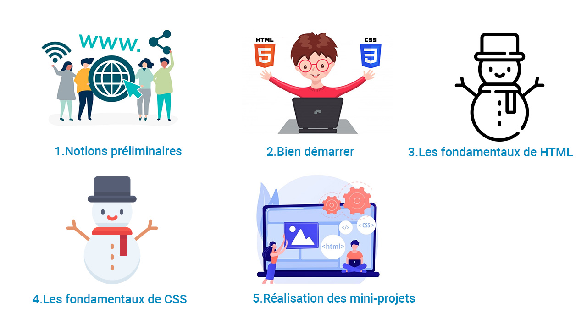
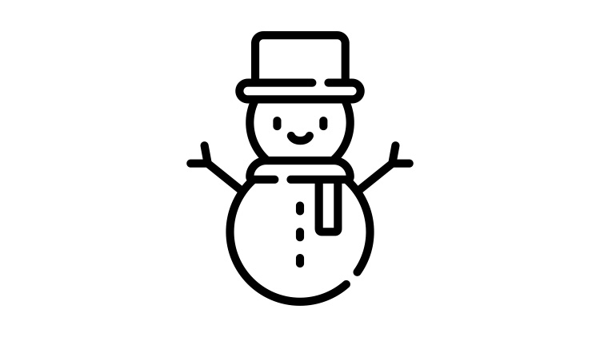

# Plan de la formation

La formation est diviser en **cinq sections**.

1. Notion préliminaire
2. Bien démarrer
3. Les fondamentaux de HTML
4. Les fondamentaux de CSS
5. Réalisation de 6 mini-projets
 
## Notion préliminaire

Dans la première section nommée **notion préliminaire** nous allons apprendre les notions d'internet et de web, puis nous allons découvrir les trois langages web : **HTML5**, **CSS3** et **JavaScript**. Nous clôturerons la section par l'**installation** et découvert des **outils** dont nous avons besoin dans notre formation. La section comprend deux parties : 

1. Introduction au développement Web
2. Installation des outils

## Bien démarrer

L'apprentissage d'un langage informatique comprend plusieurs détails, qui rend l'apprenant incapable de suivre et apprendre les notions étudiées. C'est pour cette raison, j'aimerais commencer mes formations par la partie **Bien démarrer** qui nous donne juste l'essentiel pour apprendre comment ça marche la technique informatique. Ensuite, nous entamons les parties suivantes pour enrichir nos savoirs et compétences.

La section comprend deux parties : 

1. Bien démarrer avec HTML 
2. Bien démarrer avec CSS

## Les fondamentaux de HTML

Dans la troisième section nous allons voir les fondamentaux de HTML comme par exemple la structuration d'un texte avec des liens et des images, la structuration d'un formulaire de saisie et la présentation des données sous forme d'un tableau. Nous terminerons la section par découvrir la sémantique des balises HTML. 

La section comprend les parties suivantes : 

1. Notions de base de HTML
2. Texte en HTML
3. Lien et image
4. Formulaire
5. Tableaux
6. Sémantique des balises HTML

## Les fondamentaux de CSS

Dans la quatrième section nommée **Les fondamentaux de CSS** nous allons voir les parties suivantes : 

1.  Notions de base de CSS
2.  Syntaxe : Modèle de boîte
3.  Syntaxe : Sélecteurs en CSS
4.  Positionnement avec Floats
5.  Positionnement avec Flexbox
6.  Positionnement avancé
7.  Responsive design
8.  Web typography

## Réalisation de 6 mini-projets

Finalement, dans la cinquième partie nous allons réaliser les 6 mini-projets suivants :  

1.  Mini-projet : Menu de navigation
2.  Mini-projet : Grid
3.  Mini-projet : Article d'un blog
4.  Mini-projet : Blog
5.  Mini-projet : Formulaire de contact
6.  Mini-projet : Page d'accueil
7.  Création d'un site web 
